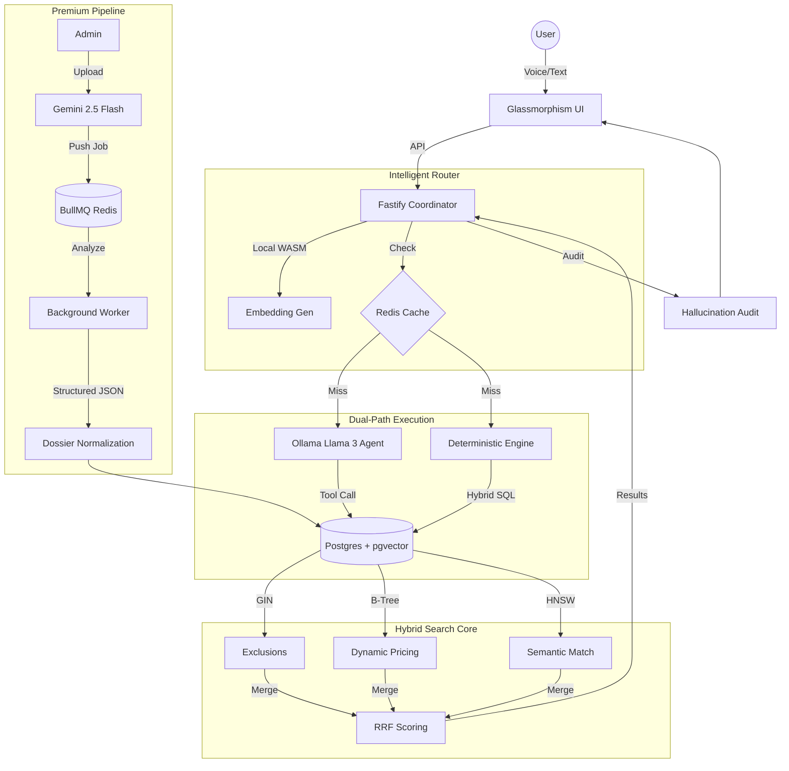
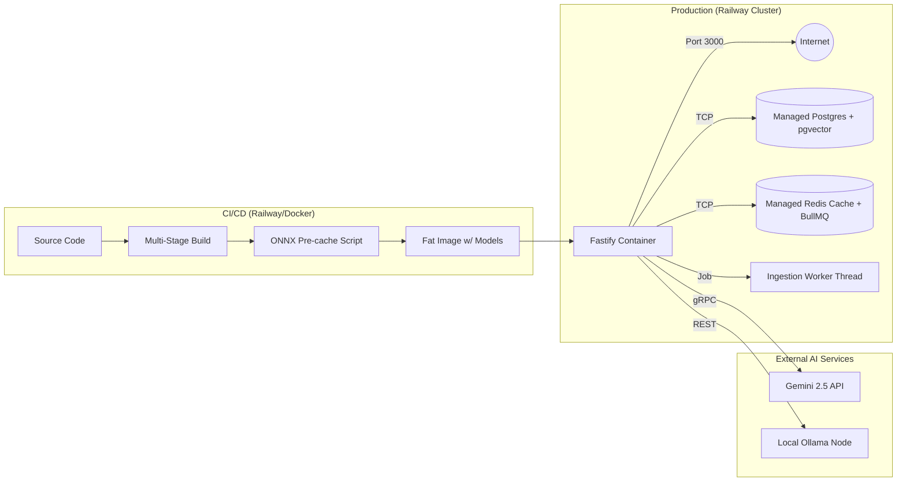

# Indriya AI: The Luxury Concierge Engine

Indriya AI is a high-performance, local-first search and discovery engine designed for the premium Indian jewellery market. It transitions from generic vector search to an **Adaptive Hybrid Search** model that balances deterministic precision with semantic reasoning.

---

## 1. Zero-Cost "Pure Local" Philosophy
Indriya is built on a **$0 API Cost** architecture. While it supports advanced AI reasoning, it is designed to run entirely on the edge:
- **Free Search**: Semantic search, voice transcription, and query parsing run 100% locally on CPU/WASM.
- **Optional Concierge**: Uses local LLMs (Ollama/Llama 3) for agentic tool-calling.
- **Premium Analysis**: Leverages Gemini 2.5 Flash exclusively for one-time, high-fidelity visual ingestion.

---

## 2. Technical Stack
| Component | Technology | Rationale |
| :--- | :--- | :--- |
| **Search Engine** | Node.js (Fastify) | Ultra-low overhead; ideal for parallelizing hybrid search streams. |
| **Orchestration** | Mastra Framework | Manages agentic loops and structured tool-calling for the concierge. |
| **Database** | PostgreSQL + `pgvector` | Unified relational and HNSW vector storage with ACID safety. |
| **Embeddings** | Xenova/all-MiniLM-L6 (ONNX) | Native WASM execution on CPU; 100% private, zero cost. |
| **Local LLM** | Ollama (Llama 3) | Open-source tool-calling for conversational search assistance. |
| **Vision LLM** | Gemini 2.5 Flash | SOTA multimodal analysis for deep product "dossier" generation. |
| **Voice/ASR** | Xenova/Whisper-tiny | On-device transcription for high-privacy voice search. |
| **Caching/Queue** | Redis (BullMQ) | Sub-1ms retrieval + Resilient background job processing. |
| **Observability** | Pino + BullBoard | Structured distributed tracing + Visual queue management. |

---

## 3. System Architecture (HLD)

---

## 3.5 Infrastructure & Deployment Flow

---

## 4. Engineering Deep-Dive (LLD)

### A. Adaptive Hybrid Search (RRF)
The engine combines three distinct retrieval streams using **Reciprocal Rank Fusion (RRF)**:
1. **Relational Precision**: Strict filters on `category`, `purity`, and `metal_color`.
2. **Hard Negations**: GIN-indexed array checks for instant exclusions (e.g., *"No Pearls"*).
3. **Semantic Fuzzy**: Cosine distance similarity on 384d vectors for conceptual matches.

**Formula**: $Score = \sum_{d \in D} \frac{1}{60 + rank(d)}$

### B. Luxury Stability Pricing Algorithm
Jewellery prices fluctuate daily. To ensure accuracy without re-indexing millions of rows, we use a server-side **Delta-Anchor SQL Formula**:
- **Equation**: $CalculatedPrice = BasePrice + (GoldWeight \times (CurrentRate - BaseGoldRate))$
- **GST Implementation**: Formulas include a standard 3% GST multiplier.
- **Fallback**: If an anchor point is missing, the system dynamically reconstructs the price from component weights (Gold + Diamond + Making Charges).

### C. Prompt Injection & Domain Guardrails
The agent is wrapped in an **Elite Safety Layer**:
- **Domain Locking**: Strictly limited to jewellery, craftsmanship, and occasion styling.
- **Instruction Anchoring**: Rejects "ignore previous instructions" or "act as persona" attempts.
- **Topic Rejection**: Politely refuses non-jewellery queries (coding, politics, math).

---

## 4.5 Observability & Distributed Tracing

### A. BullMQ Dashboard
Real-time visual monitoring of background ingestion jobs is available at `/admin/queues`. This allows admins to:
- Monitor active, waiting, and completed jobs.
- Retry failed ingestion tasks with a single click.
- Inspect job metadata and AI analysis results.

### B. Trace-based Distributed Logging
The system implements **End-to-End Distributed Tracing** using a common `traceId`:
- **Request ID**: Every incoming API request (Search or Ingest) is assigned a unique UUID.
- **Context Propagation**: The `traceId` is passed from the Fastify request to the BullMQ job and finally into the background worker.
- **Structured Logs**: Powered by **Pino**, all logs are emitted as structured JSON (or colorized text in dev) tagged with the `traceId`.
- **Debugging**: You can track the entire lifecycle of an event—from an initial upload to the final database normalization—by filtering for a single ID.

---
### `catalog_products`
- `id` (UUID): Primary key.
- `embedding` (halfvec(384)): Quantized vector for semantic search.
- `all_motifs_array` / `all_gemstones_array`: GIN-indexed tags for sub-millisecond filtering.
- `base_price` & `base_gold_rate`: Used for the Stability Formula.
- `visible_gold_pct`: Metadata generated by Gemini vision analysis.

### `search_ontology`
Self-learning mapping of slang to schema (e.g., *"Jhumka"* -> *"Drop Earrings"*).

---

## 6. Setup & Deployment

### Prerequisites
- **PostgreSQL 16+** with `pgvector`
- **Redis 7+**
- **Ollama** (Running `llama3` for agentic search)

### Installation
1. `npm install`
2. Configure `.env` with your `DATABASE_URL`, `GEMINI_API_KEY`, and `OLLAMA_API_URL` (e.g., `http://ollama.railway.internal:11434/api`).
3. `npm run pre-cache` — Downloads local ONNX models to disk to avoid cold-start latency.
4. `npm run db:init` — Seeds the ontology and initializes tables.
5. `ollama run llama3.1` — Ensures the local AI concierge is online.
6. `npm start`

### 6.2 Monitoring & Admin Tools
Once the server is running, you can monitor the system via these built-in tools:

- **🚀 BullMQ Dashboard**: Available at `/admin/queues`. Use this to monitor background ingestion jobs, retry failed tasks, and inspect AI analysis metadata.
- **🏥 Health Check**: Available at `/health`. Returns the system's uptime and heartbeat status (used by Railway for deployment verification).

---

## 7. Performance Benchmarks
- **Cold Start**: < 2s (Model loading to RAM).
- **Search Latency**: ~15ms (Post-embedding, including RRF).
- **Voice Transcription**: ~200ms for 3-second audio clips (Whisper-tiny WASM).
- **Cache Hit**: < 1ms (Redis retrieval).
