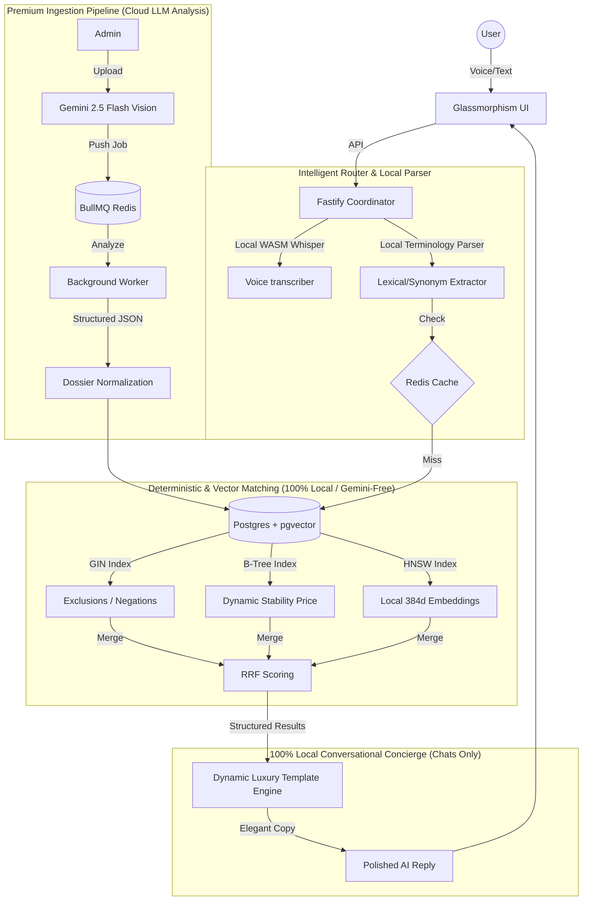

# Indriya AI: The Luxury Concierge Engine

Indriya AI is a high-performance, local-first search and discovery engine designed for the premium Indian jewellery market. It transitions from generic vector search to an **Adaptive Hybrid Search** model that balances deterministic precision with semantic reasoning.

---

## 1. Zero-Cost "Pure Local" Philosophy
Indriya is built on a **$0 API Cost** architecture designed to run entirely on the edge and deploy effortlessly in resource-constrained container environments (like Railway):
- **Free Search & NLP Parsing (100% Local & Gemini-Free)**: All semantic queries, vernacular slang mappings, price conversions, and product filtering run entirely on CPU inside the container using PostgreSQL, pgvector HNSW indexes, and WASM-native local-first NLP tools. **It is 100% independent of external LLMs like Google Gemini.**
- **100% Local Conversational Concierge (Exclusive for Chats)**: Conversational chat responses are generated purely locally on CPU via a deterministic, dynamic luxury template engine (0.1ms latency, $0 cost, unlimited scale). No cloud LLM requests are made during chat conversations, ensuring lifetime free, fast, and private operation.
- **Cloud LLM for Heavy Analysis (Exclusive for Ingestion)**: Complex multimodal and visual analysis is powered strictly by the cloud-based Google Gemini 2.5 Flash API. This runs purely as a one-time administrative background task during product ingestion to analyze jewellery assets and compile deep product dossiers, preserving maximum runtime privacy and zero runtime cost for customers.

---

## 2. Technical Stack
| Component | Technology | Rationale |
| :--- | :--- | :--- |
| **Search Engine** | Node.js (Fastify) | Ultra-low overhead; ideal for parallelizing hybrid search streams. |
| **Orchestration** | Mastra Framework | Manages agentic structures and schemas for visual analysis. |
| **Database** | PostgreSQL + `pgvector` | Unified relational and HNSW vector storage with ACID safety. |
| **Embeddings** | Xenova/all-MiniLM-L6 (ONNX) | Native WASM execution on CPU; 100% private, offline, zero cost. |
| **Concierge Generation** | Dynamic Luxury Template Engine | Pure local conversational luxury styling; 100% free, unlimited, and fast. |
| **Visual Analysis** | Gemini 2.5 Flash | Cloud-based multimodal analysis; runs exclusively for background ingestion. |
| **Voice/ASR** | Xenova/Whisper-tiny (ONNX) | On-device, 100% local transcription for high-privacy voice search. |
| **Caching/Queue** | Redis (BullMQ) | Sub-1ms retrieval + Resilient background job processing. |
| **Observability** | Pino + BullBoard | Structured distributed tracing + Visual queue management. |

---

## 3. System Architecture (HLD)



---

## 3.5 Infrastructure & Deployment Flow

```mermaid
graph LR
    subgraph "CI/CD (Railway/Docker)"
        Code[Source Code] --> Build[Multi-Stage Build]
        Build --> Precaching[ONNX Pre-cache Script]
        Precaching --> Image[Fat Image w/ Local WASM Models]
    end

    subgraph "Production (Railway Cluster)"
        Image --> Container[Fastify Container]
        Container -->|Port 3000| Internet((Internet))
        
        Container -->|TCP| PG[(Managed Postgres + pgvector)]
        Container -->|TCP| RD[(Managed Redis Cache + BullMQ)]
        Container -->|Job| Worker[Ingestion Worker Thread]
    end

    subgraph "External AI Services"
        Container -->|gRPC| Gemini[Gemini 2.5 API (Ingestion & Visual Analysis Only)]
    end
```

---

## 4. Engineering Deep-Dive (LLD)

### A. Adaptive Hybrid Search (RRF)
The engine combines three distinct retrieval streams using **Reciprocal Rank Fusion (RRF)**:
1. **Relational Precision**: Strict filters on `category`, `purity`, and `metal_color`.
2. **Hard Negations**: GIN-indexed array checks for instant exclusions (e.g., *"No Pearls"*).
3. **Semantic Fuzzy**: Cosine distance similarity on 384d vectors for conceptual matches.

**Formula**: $Score = \sum_{d \in D} \frac{1}{60 + rank(d)}$

### B. Luxury Stability Pricing Algorithm
Jewellery prices fluctuate daily. To ensure accuracy without re-indexing millions of rows, we use a server-side **Delta-Anchor SQL Formula**:
- **Equation**: $CalculatedPrice = BasePrice + (GoldWeight \times (CurrentRate - BaseGoldRate) \times 1.03)$
- **GST Implementation**: Formulas include a standard 3% GST multiplier.
- **Fallback**: If an anchor point is missing, the system dynamically reconstructs the price from component weights (Gold + Diamond + Making Charges).

### C. Local Query Translation (No LLM required)
All customer prompts undergo structured parsing in `src/utils/terminology.js` prior to database execution:
- **Vernacular Translation**: Auto-maps slang / Hindi terminology like *"Jhumkas"* to earrings and *"Thushi"* to necklaces.
- **Shorthand Processing**: Converts monetary terms like *"1.5 Lakhs"* or *"90k"* into raw integer bounds (`150000` and `90000` respectively).
- **Negation Extraction**: Parses negation keywords (e.g. *"excluding"*, *"without"*, *"no"*) to isolate items to exclude via Postgres GIN array operations.

---

## 4.5 Observability & Distributed Tracing

### A. BullMQ Dashboard
Real-time visual monitoring of background ingestion jobs is available at `/admin/queues`. This allows admins to:
- Monitor active, waiting, and completed jobs.
- Retry failed ingestion tasks with a single click.
- Inspect job metadata and AI analysis results.

### B. Trace-based Distributed Logging
The system implements **End-to-End Distributed Tracing** using a common `traceId`:
- **Request ID**: Every incoming API request (Search or Ingest) is assigned a unique UUID.
- **Context Propagation**: The `traceId` is passed from the Fastify request to the BullMQ job and finally into the background worker.
- **Structured Logs**: Powered by **Pino**, all logs are emitted as structured JSON (or colorized text in dev) tagged with the `traceId`.
- **Debugging**: You can track the entire lifecycle of an event—from an initial upload to the final database normalization—by filtering for a single ID.

---

### `catalog_products`
- `id` (UUID): Primary key.
- `embedding` (halfvec(384)): Quantized vector for semantic search.
- `all_motifs_array` / `all_gemstones_array`: GIN-indexed tags for sub-millisecond filtering.
- `base_price` & `base_gold_rate`: Used for the Stability Formula.
- `visible_gold_pct`: Metadata generated by Gemini vision analysis.

### `search_ontology`
Self-learning mapping of slang to schema (e.g., *"Jhumka"* -> *"Drop Earrings"*).

---

## 6. Setup & Deployment

### Prerequisites
- **PostgreSQL 16+** with `pgvector`
- **Redis 7+**
- **Google Gemini API Key** (Required strictly for background product ingestion/multimodal analysis)

### Installation
1. `npm install`
2. Configure `.env` with your `DATABASE_URL`, `REDIS_URL`, and optional `GEMINI_API_KEY`.
3. `npm run pre-cache` — Downloads local ONNX models (`all-MiniLM-L6-v2` and `whisper-tiny`) to disk to avoid cold-start latency.
4. `npm run db:init` — Seeds the ontology and initializes tables.
5. `npm start`

### 6.2 Monitoring & Admin Tools
Once the server is running, you can monitor the system via these built-in tools:

- **🚀 BullMQ Dashboard**: Available at `/admin/queues`. Use this to monitor background ingestion jobs, retry failed tasks, and inspect AI analysis metadata.
- **🏥 Health Check**: Available at `/health`. Returns the system's uptime and heartbeat status (used by Railway for deployment verification).

---

## 7. Performance Benchmarks
- **Cold Start**: < 2s (Model loading to RAM).
- **Search Latency**: ~15ms (Post-embedding, including RRF).
- **Voice Transcription**: ~200ms for 3-second audio clips (Whisper-tiny WASM).
- **Cache Hit**: < 1ms (Redis retrieval).
