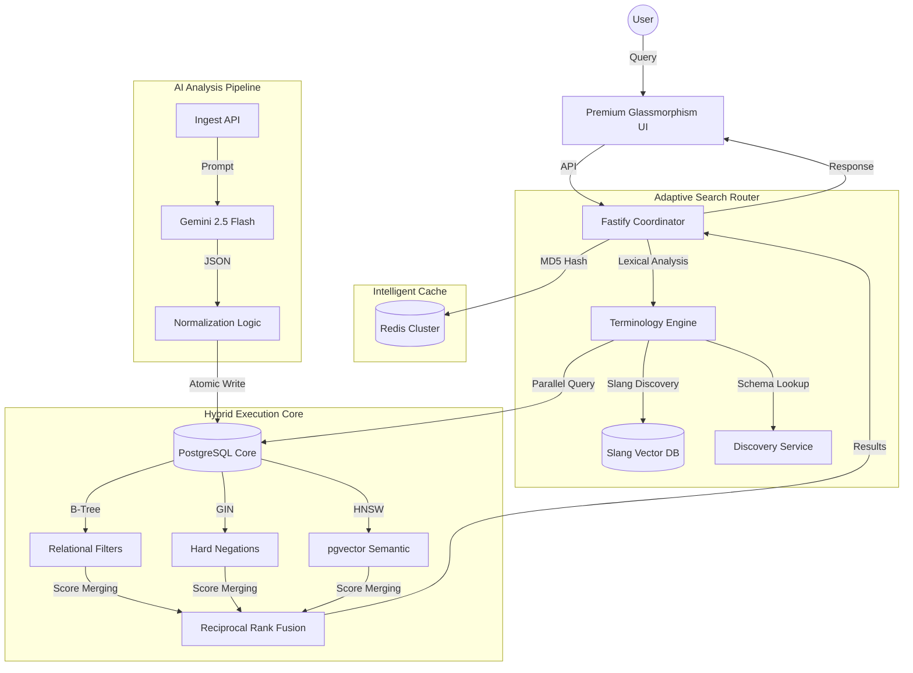

# Indriya AI Catalogue Search: Architectural Deep-Dive

## 1. Executive Summary
Indriya AI is a high-performance, local-first search engine designed specifically for the luxury Indian jewelry market. It transitions away from generic vector search towards an **Adaptive Hybrid Search** model that combines exact relational constraints with semantic understanding and dynamic real-time pricing.

---

## 2. Technical Stack
| Component | Technology | Rationale |
| :--- | :--- | :--- |
| **Core Engine** | Node.js (Fastify) | Ultra-low overhead, asynchronous I/O for parallel query execution. |
| **AI Orchestration** | Mastra Agentic Framework | Structured tool-calling and agentic loops for hallucination-free search. |
| **Database** | PostgreSQL + `pgvector` | Unified relational and vector storage with ACID compliance. |
| **Vector Indexing** | HNSW (Hierarchical Navigable Small Worlds) | Sub-10ms similarity search on 384d vectors. |
| **Embedding Model** | Xenova/all-MiniLM-L6-v2 (ONNX) | Native WASM execution on CPU; $0 API cost, 100% privacy. |
| **Cache Layer** | Redis (with SCAN & MD5) | Sub-1ms retrieval for recurring complex queries and dashboard views. |
| **Primary LLM** | Gemini 2.5 Flash | SOTA reasoning for product analysis and conversational correction. |

---

## 3. High-Level Architecture (HLD)

---

## 4. Low-Level Architecture (LLD) & Algorithms

### A. Adaptive Hybrid Search Algorithm
The engine does not rely on a single search method. Instead, it uses **Reciprocal Rank Fusion (RRF)** to combine three distinct streams:
1.  **Relational Filtering (Precision 100%)**: Exact matches on `category`, `purity`, `metal_color`, and `occasion`.
2.  **GIN Exclusions (Hard Negations)**: Uses Generalized Inverted Indexes for instant exclusions (e.g., *"without pearls"*).
3.  **HNSW Vector Similarity (Semantic)**: Uses cosine distance on 384-dimensional embeddings for fuzzy/conceptual matches.

**Formula**: $Score = \sum_{d \in D} \frac{1}{k + rank(d)}$ (where $k=60$)

### B. Dynamic Pricing Engine (Luxury Stability Algorithm)
Unlike static e-commerce, prices fluctuate daily based on global metal rates. To preserve the value of high-end diamonds and artistry while keeping metal costs dynamic, we use a **Delta-based Stability Model**:
-   **Equation**: $Price = BasePrice + (GoldWeight \times (CurrentRate - BaseGoldRate)) + \Delta(Gemstones)$
-   Implemented as a **Server-Side SQL COALESCE Block** that anchors in the `base_price` for maximum accuracy, with a component-based fallback for un-anchored records.

### C. In-Process Embedding Generation
To maintain zero API costs, we use **Transformers.js (ONNX Runtime)**:
-   **Model**: `all-MiniLM-L6-v2`
-   **Performance**: Quantized to 8-bit for CPU optimization.
-   **Caching**: Embedding results are MD5-hashed and stored in Redis for 7 days to eliminate redundant WASM overhead.

---

## 5. Database Schema Details

### Core Tables
-   **`catalog_products`**: The master record. Includes `halfvec(384)` for embeddings and GIN-indexed arrays for motifs/gemstones.
-   **`product_motifs` / `product_occasions`**: Normalized sub-tables supporting the "Dossier" view and multi-intent filtering.
-   **`daily_metal_rates`**: Tracks fluctuating costs for Gold (24K, 22K, 18K, 14K), Platinum, and Silver.
-   **`slang_vectors`**: Self-learning dictionary for regional terms (e.g., *Vanki*, *Jhumka*, *Thushi*).

### High-Performance Indexes
-   **HNSW (`idx_cat_prod_embedding_hnsw`)**: `m=16, ef_construction=64` for balanced recall/speed.
-   **GIN (`idx_cat_prod_gemstones_array`)**: For sub-millisecond array containment checks.
-   **B-Tree**: On all numeric columns for range-based price filtering.

---

## 6. Caching & Invalidation Strategy
The system uses a **Sliding Window Cache Invalidation** pattern:
-   **Search Cache (`search:*`)**: MD5 hash of (query + filters + limit). TTL: 1 Hour.
-   **Product Cache (`products:*`)**: Dashboard view caching. TTL: 10 Minutes.
-   **Global Invalidation**: Any POST to `/api/ingest` or `/api/rates` triggers a **Non-Blocking Redis SCAN** to flush all dependent search caches, ensuring data integrity.

---

## 7. Setup & Implementation
For local development, ensure you have **PostgreSQL 16+ with pgvector** and **Redis 7+** installed.
1. `npm install`
2. `npx db_init.mjs` (Initializes schema and seeds ontology)
3. `npm start`
